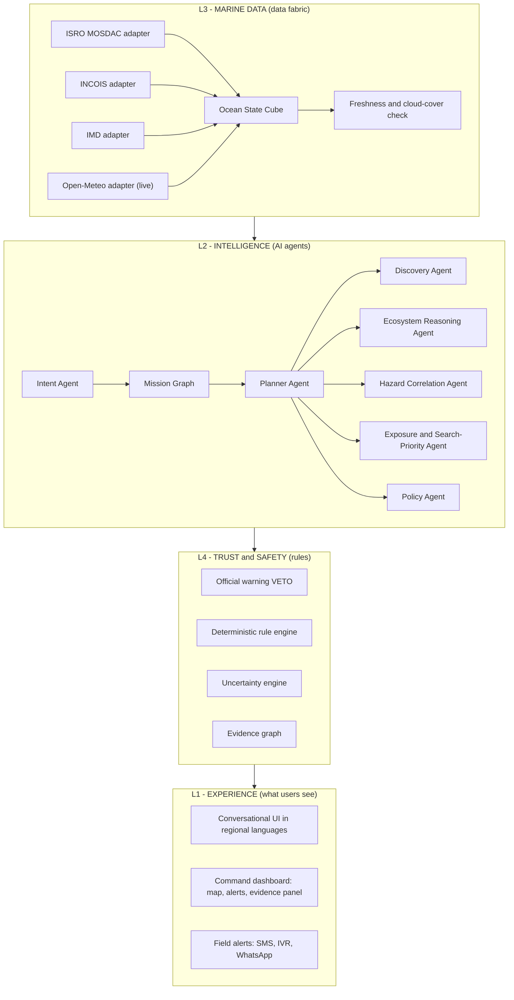
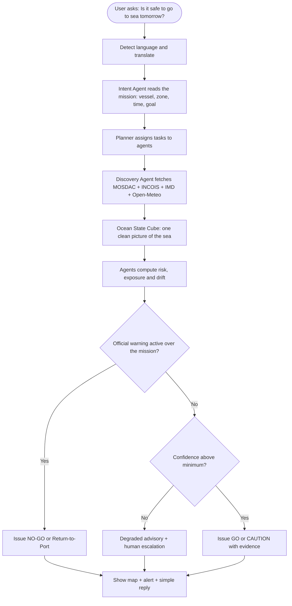
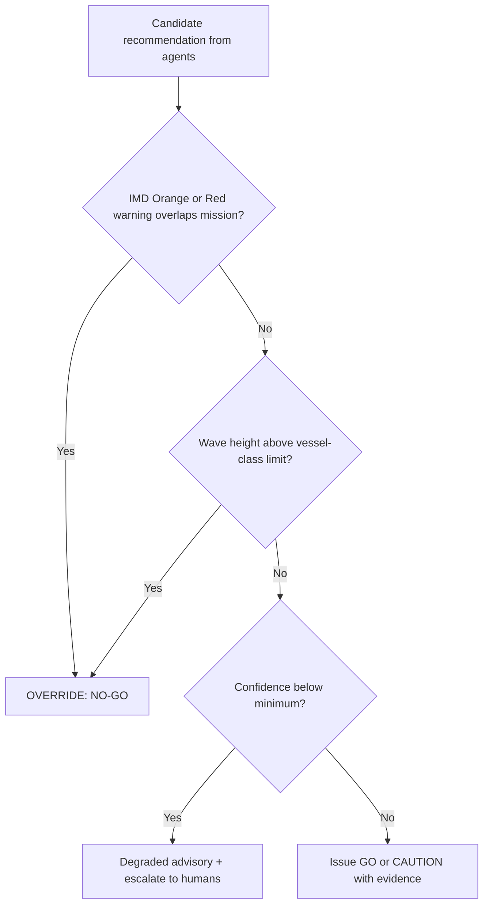
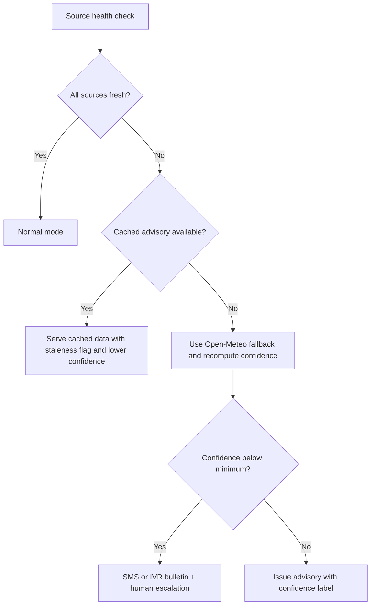
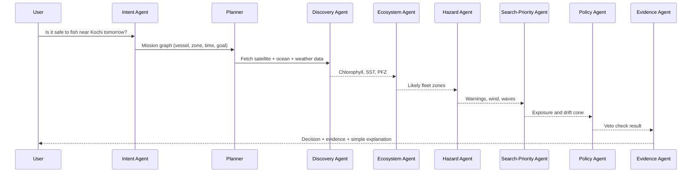

# ORCA — Ocean Risk & Coastal Assistance
### Powered by the EcoDrift Engine (Ecosystem-Anchored Disaster Decision Intelligence)

> Smart India Hackathon 2026 • Problem Statement ID: SIH26176
> Problem Statement Title: ORCA Marine Ecosystem Reasoning with Collaborative Agents
> Theme: Space Technology (Downstream Space Applications) • Sponsor: ISRO • Team: Team Meg

---

## Table of Contents
1. [What is ORCA? (Simple Explanation)](#1-what-is-orca-simple-explanation)
2. [The Problem We Solve](#2-the-problem-we-solve)
3. [Our Solution: EcoDrift](#3-our-solution-ecodrift)
4. [Core Rule: Agentic, Not Autonomous](#4-core-rule-agentic-not-autonomous)
5. [Key Features](#5-key-features)
6. [Architecture Diagram](#6-architecture-diagram)
7. [How One Mission Flows (Flowchart)](#7-how-one-mission-flows-flowchart)
8. [Safety Veto Logic (Flowchart)](#8-safety-veto-logic-flowchart)
9. [Degraded Mode (Flowchart)](#9-degraded-mode-flowchart)
10. [How the Agents Work Together (Sequence Diagram)](#10-how-the-agents-work-together-sequence-diagram)
11. [Data We Use](#11-data-we-use)
12. [Simple Math Behind the Drift Cone](#12-simple-math-behind-the-drift-cone)
13. [Tech Stack](#13-tech-stack)
14. [Folder Structure](#14-folder-structure)
15. [Setup and Run](#15-setup-and-run)
16. [API Documentation](#16-api-documentation)
17. [Demo Scenarios for Judges](#17-demo-scenarios-for-judges)
18. [Testing](#18-testing)
19. [Future Roadmap](#19-future-roadmap)
20. [Limitations and Disclaimer](#20-limitations-and-disclaimer)
21. [Team](#21-team)

---

## 1. What is ORCA? (Simple Explanation)

ORCA is a **smart safety assistant for the sea**.

India already has amazing ocean data — ISRO satellites see the ocean from space, INCOIS predicts waves and fishing zones, and IMD warns about cyclones. But this data lives in many separate places and is hard to understand for a fisherman or a local officer.

ORCA brings all this data together and answers **simple human questions**, like:
- "Is it safe to go to the sea tomorrow morning?"
- "Where is the nearest good fishing zone today?"
- "A boat is missing since 4 hours. Where should we search?"

And it answers with **clear decisions**: GO / CAUTION / DO NOT GO / RETURN TO PORT / SEARCH HERE — always with proof (evidence) of why.

---

## 2. The Problem We Solve

1. **Data is scattered** — ISRO, INCOIS and IMD data live in separate portals.
2. **Data is not a decision** — A chart of wave height does not tell a fisherman "do not go today."
3. **Disasters wait for no one** — During a cyclone, slow interpretation costs lives.
4. **AI cannot be trusted blindly** — A chatbot that "guesses" safety is dangerous.

---

## 3. Our Solution: EcoDrift

**EcoDrift** is the brain of ORCA. It works in two modes:

**Normal days (Peacetime):**
It reads satellite ecosystem data (chlorophyll = fish food, SST = water temperature, PFZ = fishing zones) and helps fishermen find good fishing spots safely.

**Storm days (Crisis mode):**
It remembers where boats likely went (the fishing zones), checks the storm path, and:
- Sends **Do-Not-Depart** and **Return-to-Port** alerts in local language.
- If a boat is missing, it draws a **Search-Priority Cone** on the map showing where the boat most likely drifted.

---

## 4. Core Rule: Agentic, Not Autonomous

This is our most important design rule.

- **AI agents** collect data, reason, and explain in simple language.
- **Hard-coded safety rules and official government warnings** make the final life-or-death decision.
- If IMD says "Red Alert", the AI **cannot** say "it is safe". The warning automatically wins (veto).
- The AI **never does safety math**. Drift and risk math is done by fixed, tested code (deterministic), not by a language model.

In short: **AI explains. Rules decide.**

---

## 5. Key Features

- **Live Open-Meteo Marine data** — real waves, swell, currents, sea temperature.
- **EcoDrift Search & Rescue cone** — predicts where a missing boat drifted using wind + current + time.
- **Ecosystem exposure mapping** — uses chlorophyll/SST/PFZ to guess where fleets are when a storm hits.
- **Deterministic safety veto** — official warnings always override AI.
- **Satellite-aware uncertainty** — knows when clouds block satellites or data is old, and says so honestly ("Degraded Mode").
- **Evidence Graph** — every answer shows its proof: which source, what time, which rule.
- **Regional languages** — English, Hindi, Marathi (auto-detect for Mumbai/Goa coasts), via Bhashini-ready design.
- **Geofencing** — warns near international boundaries (IMBL) and protected marine areas.
- **Offline demo mode** — works without internet for hackathon demos and dead zones.

---

## 6. Architecture Diagram

ORCA has 4 layers. Data flows up, decisions flow down.



---

## 7. How One Mission Flows (Flowchart)



---

## 8. Safety Veto Logic (Flowchart)

This is the gate every recommendation must pass. AI cannot bypass it.



---

## 9. Degraded Mode (Flowchart)

Satellites are not CCTV cameras. Clouds block them and passes are hours apart. ORCA handles this honestly.



---

## 10. How the Agents Work Together (Sequence Diagram)



---

## 11. Data We Use

| Data point | What it means | Source |
|---|---|---|
| Chlorophyll-a | Fish food in water (ecosystem) | ISRO MOSDAC |
| SST | Sea surface temperature | ISRO MOSDAC |
| Ocean wind vectors | Wind speed + direction over sea | ISRO / IMD |
| Cloud cover | Whether optical satellites can see | ISRO INSAT |
| Ocean currents | Water movement (drift math) | INCOIS |
| Wave height (Hs) | Safety threshold for small boats | INCOIS / Open-Meteo |
| PFZ | Potential fishing zones | INCOIS |
| Warning colour code | Green/Yellow/Orange/Red alerts | IMD |
| Cyclone track | Storm path and landfall time | IMD |
| Tide and swell | Harbour entry safety | INCOIS / Open-Meteo |

**Live baseline for the hackathon:** Open-Meteo Marine API (no key needed). Government adapters (MOSDAC/INCOIS/IMD) are architecturally ready and use realistic mock data where live access needs approval.

---

## 12. Simple Math Behind the Drift Cone

No AI is used here. This is fixed, testable math.

**1. Drift speed** = current + (leeway factor × wind)
`V_drift = V_current + gamma * V_wind`
(gamma = how much wind pushes that boat type, usually 0.01 to 0.05)

**2. Predicted position** = last known point + drift × time
`P(t) = P0 + V_drift * t`

**3. Search radius grows with time and old data**
`R(t) = R0 + alpha * t + beta * data_age`

**4. Confidence score** = freshness + source agreement + coverage
`C = w1*F + w2*A + w3*S` (value between 0 and 1)

If confidence is low, the cone gets bigger and the UI shows a warning. Honest uncertainty, never fake certainty.

---

## 13. Tech Stack

| Layer | Technology |
|---|---|
| Frontend | React (Vite/Next.js), TypeScript, Tailwind CSS, Leaflet maps, PWA |
| Backend | Python, FastAPI, LangGraph/CrewAI (agents), deterministic rule engine |
| Database & Geo | PostgreSQL + PostGIS, Redis cache, GeoPandas, Rasterio/NetCDF4 |
| AI | Gemini 2.0 Flash (intent + explanation ONLY), Bhashini-ready translation |
| Live data | Open-Meteo Marine API; adapters for MOSDAC, INCOIS, IMD, Bhuvan |
| DevOps | Docker, Docker Compose, Pytest |

---

## 14. Folder Structure

```text
orca-platform/
├── backend/
│   ├── app/
│   │   ├── main.py              # FastAPI entry point and CORS
│   │   ├── config.py            # Settings and environment variables
│   │   ├── agents/              # LangGraph workflows (Intent, Planner, Policy)
│   │   ├── core/                # Deterministic risk engine + drift math (NO LLM)
│   │   ├── data_fabric/         # Adapters: MOSDAC, INCOIS, IMD, Open-Meteo
│   │   ├── routes/              # API endpoints (assess, drift, health)
│   │   ├── schemas/             # Pydantic models (Mission, OceanState, Evidence)
│   │   ├── services/            # openmeteo_service.py, LLM service, translation
│   │   └── demo/                # Offline demo data (chennai.json, kochi.json)
│   ├── tests/                   # Pytest suite
│   └── requirements.txt
├── frontend/
│   ├── src/
│   │   ├── components/          # MapPicker, RiskBadgeCard, DegradedModeBanner
│   │   ├── services/            # API client, translation hooks
│   │   └── App.jsx              # Main app
│   └── package.json
├── docker-compose.yml
└── README.md
```

---

## 15. Setup and Run

**You need:** Python 3.10+, Node 18+, (optional) Docker.

**Backend**
```bash
cd backend
python -m venv venv
source venv/bin/activate        # Windows: venv\Scripts\activate
pip install -r requirements.txt
copy .env.example .env          # add your LLM key here
python run.py                   # runs at http://127.0.0.1:8000 (docs at /docs)
```

**Frontend**
```bash
cd frontend
npm install
npm run dev                     # runs at http://localhost:5173
```

**With Docker (optional)**
```bash
docker-compose up --build
```

---

## 16. API Documentation

### POST /api/assess
Checks one location and returns risk + evidence + explanation.

Request:
```json
{
  "latitude": 13.0827,
  "longitude": 80.2707,
  "label": "Chennai Coast",
  "demo": false,
  "include_explanation": true
}
```

Response (shortened):
```json
{
  "risk": { "score": 48.5, "level": "MODERATE", "warning_override": false },
  "ocean": { "wave_height_m": 1.8, "ocean_current_speed_kmph": 2.1 },
  "data_status": "live",
  "explanation": {
    "text": "Moderate wind and 1.8 m waves. Be careful near the coast.",
    "guardrail": "Advisory only. This text cannot change the risk score."
  }
}
```

### POST /api/sar/drift-cone
Returns the search area for a missing boat as a map polygon.

Request:
```json
{
  "last_known_position": { "lat": 9.93, "lon": 76.26 },
  "hours_elapsed": 4,
  "vessel_type": "mechanized_small"
}
```

---

## 17. Demo Scenarios for Judges

1. **Live assessment** — Pick Chennai Coast. Live Open-Meteo data flows in. Risk score + evidence panel appear.
2. **Cyclone veto** — Switch to Demo Mode, pick Kochi Port. The Orange Alert triggers the veto: screen shows DO NOT DEPART, and the AI cannot argue.
3. **Search & Rescue** — Fire a mock SOS. The drift cone appears on the map, expanded because the "satellite data is 4 hours old" (Degraded Mode banner visible).
4. **Regional language** — Pan the map to Mumbai/Goa. The explanation automatically switches to Marathi. Scores stay unchanged.

---

## 18. Testing

```bash
python -m pytest tests/test_assess.py tests/test_risk_engine.py tests/test_marathi_regional.py
```

Key tests: veto always wins, null data is penalized (never treated as zero), drift cone grows with data age.

---

## 19. Future Roadmap

1. **All-weather SAR/microwave** — ISRO RISAT data to see through cyclone clouds.
2. **Coastal digital twin** — Bhuvan-based storm-surge and evacuation simulation.
3. **Off-grid mesh alerts** — boat-to-boat SMS/radio relay when towers fail.
4. **Secure AIS intelligence** — federated learning on encrypted vessel data.

---

## 20. Limitations and Disclaimer

- Open-Meteo is the live baseline; MOSDAC/INCOIS/IMD adapters use realistic mock data where live access needs institutional approval. Integration status is always labelled: live / partial / mock / future.
- Drift math is a heuristic; production would couple with full hydrodynamic models.
- ORCA is a **decision-support tool**. It does not replace IMD, INCOIS, ISRO or Coast Guard systems. The sea is never declared "guaranteed safe".

---

## 21. Team

**Team Meg** — Smart India Hackathon 2026
[Noorulain Bedrekar] • [Anushka Singh] • [krishna Yadu] • [Muzzammil Sheikh] • [Namish Dhawale] • [Arya Yadav]

*Smarter Decisions → Safer Coasts → A Healthier Ocean*
