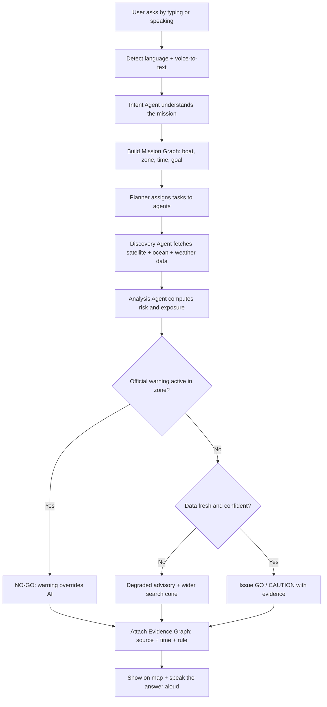
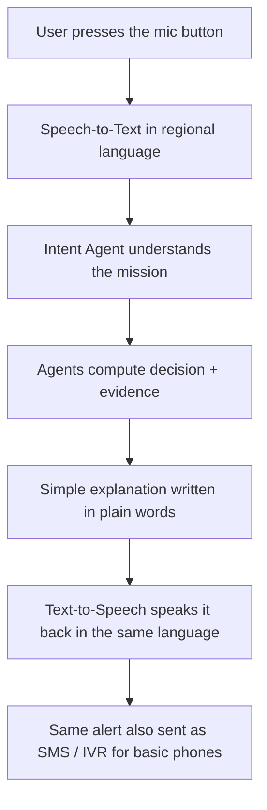
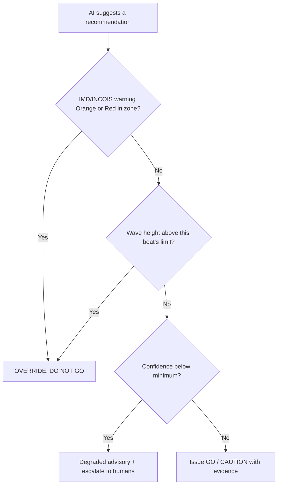
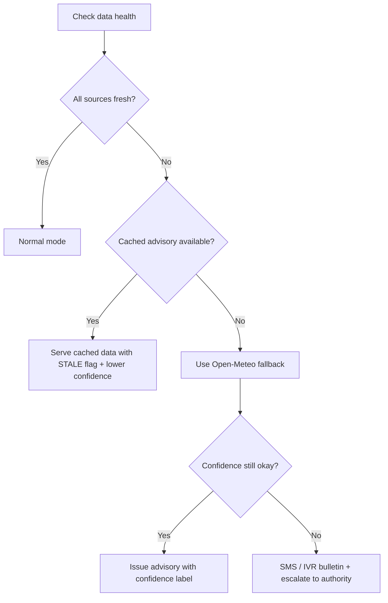

# ORCA — Ocean Risk & Coastal Assistance
### From space satellites to village coasts: simple, safe, voice-enabled marine decisions.

> **Smart India Hackathon (SIH) 2026** | PS ID: **SIH26176** — *ORCA Marine Ecosystem Reasoning with Collaborative Agents*
> **Sponsor:** ISRO | **Theme:** Space Technology (Downstream Space Applications) | **Team:** Team Meg

---

## 📑 Table of Contents
1. [What is ORCA?](#1-what-is-orca)
2. [The Problem We Solve](#2-the-problem-we-solve)
3. [How ORCA Works (Simple Steps)](#3-how-orca-works)
4. [Key Features](#4-key-features)
5. [Voice Assistance (Live in Prototype)](#5-voice-assistance)
6. [Architecture (4 Layers)](#6-architecture)
7. [Safety First: Agentic, Not Autonomous](#7-safety-first)
8. [Data We Use](#8-data-we-use)
9. [Tech Stack](#9-tech-stack)
10. [Folder Structure](#10-folder-structure)
11. [Setup & Run](#11-setup--run)
12. [Demo Guide for Judges](#12-demo-guide)
13. [API Highlights](#13-api-highlights)
14. [Roadmap](#14-roadmap)
15. [Limitations & Disclaimer](#15-limitations--disclaimer)

---

## 1. What is ORCA?

ORCA is a web platform that reads **ocean data from space** (ISRO satellites), **ocean labs** (INCOIS) and **weather offices** (IMD), and turns it into **simple answers** like:

- ✅ **SAFE TO GO**
- ⚠️ **CAUTION**
- ⛔ **DO NOT GO / RETURN TO PORT**
- 🔍 **SEARCH HERE** (for missing boats)

Its core engine, **EcoDrift**, looks at the marine ecosystem (where fish zones are) to understand **where boats likely are**, and overlays storm/wave danger on top of it.

**Golden rule of ORCA:** AI only *reads and explains*. Fixed safety rules and official government warnings make the final decision. AI can never override a Red Alert.

---

## 2. The Problem We Solve

- Marine data lives in **many separate portals** (ISRO, INCOIS, IMD). A fisherman cannot read 5 websites during a storm.
- Raw charts do **not answer real questions** like *"Is it safe for MY boat to go tomorrow?"*
- During cyclones, **clouds blind optical satellites**, and old data creates false confidence.
- Many coastal users **cannot read complex bulletins** — they need to *hear* the warning in their own language.

---

## 3. How ORCA Works



**In plain words:**
1. User asks (typing or voice).
2. Agents collect the right satellite/ocean/weather data.
3. Fixed rules check official warnings first.
4. ORCA gives one simple answer **with proof** (which source, what time, which rule).
5. The answer is shown on a map **and spoken aloud** in the user's language.

---

## 4. Key Features

- 🎙️ **Voice Assistant** — speak your question, hear the answer in your language (built for low-literacy users).
- 🛰️ **Live Open-Meteo Marine data** — real waves, swell, currents, sea temperature.
- 🧠 **EcoDrift Engine** — uses fish-zone (ecosystem) data to estimate where fleets are and where missing boats may drift.
- 🛡️ **Deterministic Safety Veto** — official Orange/Red warnings automatically override AI.
- 🌥️ **Uncertainty Engine** — detects cloud cover and old satellite data; shows "low confidence" instead of guessing.
- 🗺️ **Interactive coastal map** — PFZ zones, warning corridors, search cones.
- 🌐 **Multilingual** — English, Hindi, Marathi (auto-detect by region, e.g., Mumbai/Goa → Marathi).
- 📴 **Degraded Mode** — works with cached/fallback data when APIs fail, and clearly says so.
- 🧾 **Evidence Graph** — every answer shows its proof: source, timestamp, rule.

---

## 5. Voice Assistance

Voice assistance is **live in the prototype**. A fisherman never needs to read or type.



**How it behaves:**
- Press mic → ask *"Is it safe to go to sea tomorrow?"* in your language.
- ORCA converts speech to text, computes the decision, and **speaks the answer back**.
- Language is auto-detected by location (Mumbai/Goa → Marathi) with manual override.
- For feature phones, the same message is delivered via **SMS / IVR voice call**.

---

## 6. Architecture

```mermaid
graph TD
    subgraph EXP["L1 - EXPERIENCE (user screens)"]
        chat[Chat UI]
        voice[Voice Assistant]
        dash[Command Dashboard + Map]
        alert[Field Alerts: SMS / IVR / WhatsApp]
    end

    subgraph INT["L2 - INTELLIGENCE (AI agents)"]
        intent[Intent Agent] --> graph[Mission Graph] --> plan[Planner Agent]
        plan --> disc[Discovery Agent]
        plan --> eco[Ecosystem Agent]
        plan --> haz[Hazard Agent]
        plan --> ana[Analysis Agent]
        plan --> sar[Search / Exposure Agent]
        plan --> pol[Policy Agent]
    end

    subgraph DATA["L3 - MARINE DATA (data fabric)"]
        mos[ISRO MOSDAC adapter] --> cube[Ocean State Cube]
        inc[INCOIS adapter] --> cube
        imd[IMD adapter] --> cube
        om[Open-Meteo live adapter] --> cube
        cube --> fresh[Freshness + Cloud Check]
    end

    subgraph TRUST["L4 - TRUST & SAFETY (fixed rules)"]
        veto[Official Warning VETO] --> rules[Rule Engine] --> unc[Uncertainty Engine] --> evi[Evidence Graph]
    end

    chat --> intent
    voice --> intent
    dash --> intent
    fresh --> disc
    sar --> veto
    pol --> veto
    evi --> chat
    evi --> voice
    evi --> dash
    evi --> alert
```

**Quick view:**
```
USER (chat / voice / dashboard / SMS)
              |
              v
     AI AGENTS (plan + reason)
              |
              v
DATA FABRIC (satellite + ocean + weather)
              |
              v
SAFETY LAYER (rules + veto + evidence)
              |
              v
SIMPLE ANSWER (Go / No-Go / Search here) + SPOKEN ALOUD
```

---

## 7. Safety First

**"Agentic, Not Autonomous"** — agents plan and explain, but fixed rules decide safety.



**Data failure handling (Degraded Mode):**



---

## 8. Data We Use

| What we measure | Why it matters | Source |
|---|---|---|
| Chlorophyll (fish food) | Shows likely fishing zones | ISRO MOSDAC |
| Sea Surface Temperature (SST) | Ecosystem + fish zones | ISRO MOSDAC |
| Wind speed & direction | Drift + safety | ISRO / IMD / Open-Meteo |
| Cloud cover | Can the satellite even see? | ISRO INSAT |
| Ocean currents | Drift prediction for search | INCOIS / Open-Meteo |
| Wave height | Small-boat danger limit | INCOIS / Open-Meteo |
| Official warning colour | Triggers the VETO | IMD / INCOIS |
| Fishing zone maps (PFZ) | Where fleets likely are | INCOIS |
| Boat width & type | Small boat = higher risk | Vessel registry |

**Simple math we use (no AI guessing):**
- **Drift speed** = ocean current + (boat factor × wind)
- **Search circle** grows bigger as time passes and as data gets older
- **Confidence** = data freshness + source agreement + coverage

---

## 9. Tech Stack

| Layer | Technology |
|---|---|
| Frontend | React (Vite), TypeScript, Tailwind CSS, Leaflet maps, PWA |
| Voice | Web Speech API + Bhashini (STT/TTS in regional languages) |
| Backend | Python, FastAPI, LangGraph (agents), fixed-rule engine |
| Database & Geo | PostgreSQL + PostGIS, Redis, GeoPandas, Rasterio/NetCDF4 |
| AI | Gemini 2.0 Flash — intent & explanation ONLY (never safety math) |
| Live Data | Open-Meteo Marine API (live); ISRO/INCOIS/IMD via adapters |
| DevOps | Docker, Docker Compose, Pytest |

---

## 10. Folder Structure

```
orca-platform/
├── backend/
│   ├── app/
│   │   ├── main.py            # FastAPI entry point
│   │   ├── agents/            # LangGraph workflows (Intent, Planner, Policy...)
│   │   ├── core/              # Deterministic Risk Engine + Drift math (NO LLM)
│   │   ├── services/          # openmeteo_service.py, voice_service.py, LLM service
│   │   ├── schemas/           # Pydantic models (Mission, OceanState, Evidence)
│   │   └── demo/              # Offline demo data (chennai.json, kochi.json)
│   ├── tests/                 # Pytest suite
│   └── requirements.txt
├── frontend/
│   ├── src/
│   │   ├── components/        # MapPicker, RiskBadgeCard, VoiceButton, EvidencePanel
│   │   ├── services/          # API client, speech (STT/TTS) hooks
│   │   └── App.jsx
│   └── package.json
├── docker-compose.yml
└── README.md
```

---

## 11. Setup & Run

**You need:** Python 3.10+, Node 18+, (optional) Docker.

**Backend:**
```bash
cd backend
python -m venv venv
source venv/bin/activate        # Windows: venv\Scripts\activate
pip install -r requirements.txt
copy .env.example .env          # add your LLM + Bhashini keys
python run.py                   # http://127.0.0.1:8000  (docs at /docs)
```

**Frontend:**
```bash
cd frontend
npm install
npm run dev                     # http://localhost:5173
```

**Tests:**
```bash
python -m pytest tests/
```

---

## 12. Demo Guide

1. **Voice demo:** Press mic near Mumbai on the map → ask in Marathi → hear the spoken answer.
2. **Live assessment:** Pick Chennai Coast → live Open-Meteo waves → risk score + evidence panel.
3. **Cyclone veto:** Switch to Demo Mode → pick Kochi Port → Orange alert forces **DO NOT GO** + degraded banner.
4. **Search & Rescue:** Trigger a mock SOS → EcoDrift draws the search cone on the map.

---

## 13. API Highlights

**POST /api/assess** — coastal risk for a location
```json
{ "latitude": 13.08, "longitude": 80.27, "label": "Chennai Coast", "demo": false }
```

**POST /api/voice/query** — voice mission query
```json
{ "audio_text": "उद्या समुद्रात जायला सुरक्षित आहे का?", "language": "mr" }
```
Returns: decision (GO / NO-GO), spoken_text (TTS), evidence list.

**POST /api/sar/drift-cone** — search zone for a missing boat
```json
{ "last_known_position": { "lat": 9.93, "lon": 76.26 }, "hours_elapsed": 4 }
```
Returns: GeoJSON search polygon, widened automatically if data is old.

---

## 14. Roadmap

1. **All-weather SAR/microwave** — see through cyclone clouds (ISRO RISAT).
2. **Coastal Digital Twin** — storm-surge evacuation planning on Bhuvan maps.
3. **Off-grid mesh** — boat-to-boat SOS relay when towers fail.
4. **Secure AIS** — federated learning on encrypted vessel tracks.

---

## 15. Limitations & Disclaimer

- **Live baseline** comes from Open-Meteo Marine; ISRO/INCOIS/IMD adapters use realistic demo data where live access needs government approval. Every source is labelled *live / partial / mock / future*.
- **Drift math** is a simple vector model; production would plug into full hydrodynamic models.
- ORCA is a **decision-support tool**. It does not replace IMD, INCOIS or the Coast Guard. Conditions are never declared guaranteed "safe".

---

**Built with 🌊 by Team Meg — Smart India Hackathon 2026**
